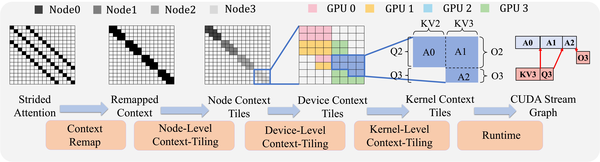
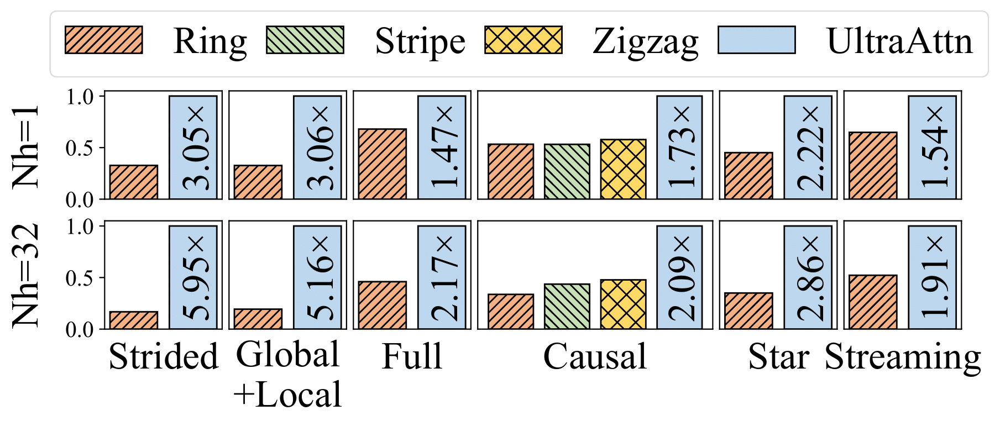
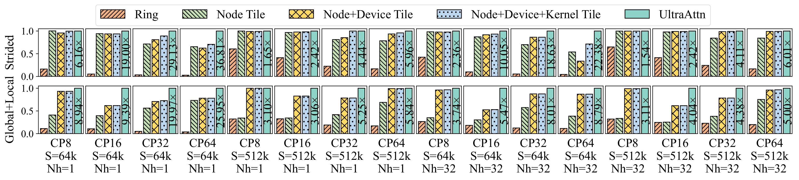
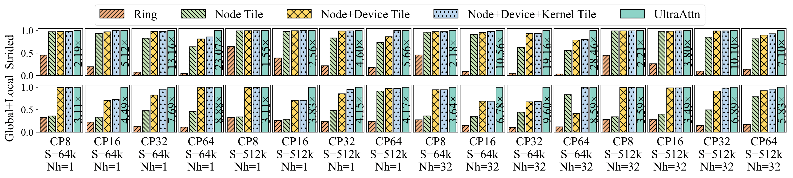
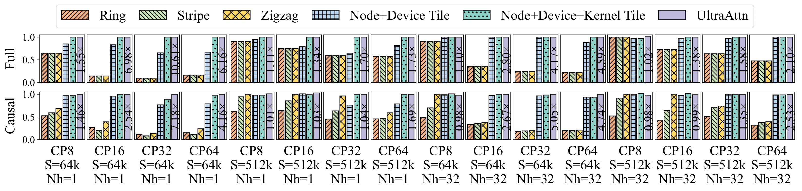
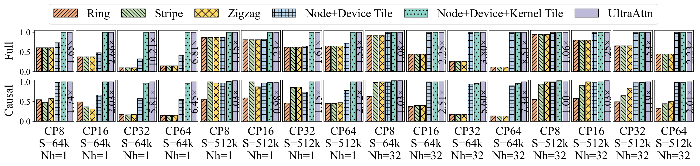
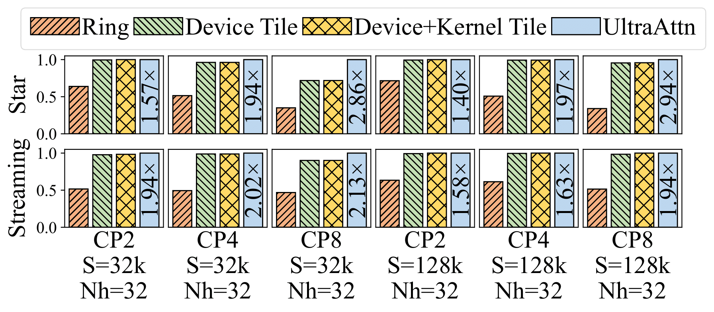

</img>

<!-- 

 -->

<h3 align="center">
Leading to automatic, adaptive and optimal context parallelism of general block sparse attention.
</h3>

<!-- [TODO] -->

| <a href="https://github.com/oliverYoung2001/UltraAttn"><b>Documentation</b></a> 
| <a href="https://github.com/oliverYoung2001/UltraAttn"><b>Blog</b></a> 
| <a href="https://github.com/oliverYoung2001/UltraAttn"><b>Paper</b></a> 
| <a href="https://github.com/oliverYoung2001/UltraAttn"><b>Developer Slack</b></a> 
|

## News
- [2025/06] 🔥 UltraAttn is accepted by The International Conference for High Performance Computing, Networking, Storage and Analysis (SC ’25).

## About
UltraAttn is an automatic and adaptive implementation of context parallelism for block sparse attention that persues optimal performance. Existing context parallelism suffers from poor scalability due to the *striped-like* partition pattern, which causes high communication traffic, and the *ring-based* communication pattern, which limits kernel granularity, reduces device utilization, and incurs redundant communication. UltraAttn **hierarchically tiles the context**
at the node and device levels to reduce communication cost, and applies kernel-level tiling to balance kernel overlap and device utilization. An ILP-based runtime further optimizes distributed attention latency. On 64 GPUs, UltraAttn achieves an average 5.5× speedup over state-of-the-art context parallelism methods across various block sparse attention types.

<!-- ## Overview -->

The core of UltraAttn is the **hierarchically context-tiling at three levels**, i.e. node, device and kernel levels follow by an ILP-based runtime. Hierarchically context-tiling aims to automatically partition and allocate workload to nodes, devices and kernels to minimize communication overhead in the condition of computational load balance. The output is an parallel dependent kernel graph. ILP-based UltraAttn runtime aims to execute the parallel dependent kernel graph efficiently.

## Getting Started

## Design Document
If you are curious or interesting about the design philosophy of UltraAttn, please refer to [UltraAttn design document](docs/design_document.md).

## Performance
### End-to-End Speedup
End-to-end relative performance of UltraAttn and baselines on Llama2-7b. Performance is normalized by UltraAttn. The speedup text above the last bar shows UltraAttn’s gain over the best baseline.
Configuration: $S$, i.e., context length, is fixed to 512k for training or prefill phase in inference. $CP$, i.e. context parallel degree, is fixed to 8 for two inference cases including star and streaming. For other four training cases, $CP$ is fixed to 64.

### Distributed Attention Speedup
#### Block Sparse Attention in Training
Relative performance, normalized by UltraAttn, of two types of block sparse attention, i.e., strided attention and global+local attention, for training from 8 GPUs to 64 GPUs. $CP$, $S$, and $Nh$ represent context parallelism degree, context length, and number of head, respectively. The first and the last blocks represent the baseline and UltraAttn, respectively. The other three blocks represent ablation studies. In these ablation studies, four optimization techniques are added one by one from left to right. The speedup text above the last bar shows UltraAttn’s gain over the best baseline.

*Forward block sparse attention*

*Backward block sparse attention*

#### Dense Attention in Training
Relative performance normalized by UltraAttn of two types of dense attention for training.

*Forward dense attention*

*Backward dense attention*

#### Block Sparse Attention in Inference
Relative performance normalized by UltraAttn of two types of block sparse attention for inference from 2 to 8 GPUs.

## Roadmaps
### Functionalities
- [ ] Support document mask attention
### Performance
- [ ] Support better kernel scheduling
- [ ] Support fusion into a megakernel
- [ ] Add flexattention in kernel backends for more flexible kernel-level context-tiling
### Memory Management
- [ ] Support optimal memory management
### Accuracy
- [ ] Support numerically stable implementation

## Contribution
We’d truly appreciate your feedback. If you run into any issues or have ideas for improvement, please don’t hesitate to share them by opening an [issue](https://github.com/oliverYoung2001/UltraAttn/issues).

## Citation
If you use UltraAttn for your research, please cite our paper.

## License
UltraAttn uses Apache License 2.0.
